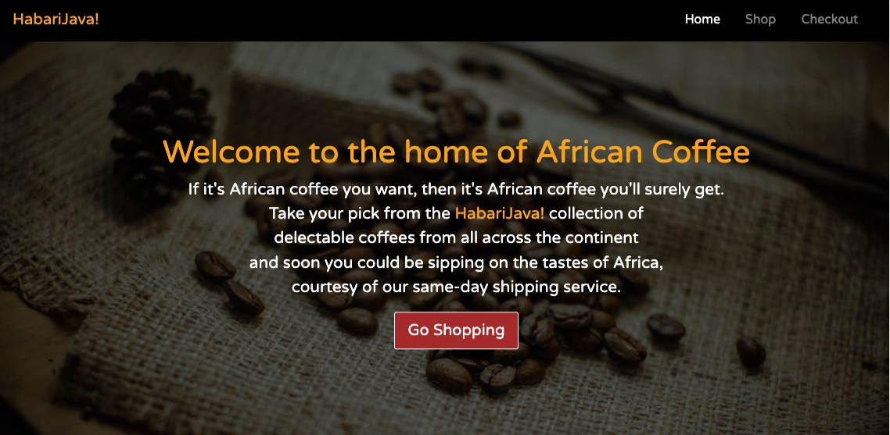

# 
# HabariJava
<table>
<tr>
<td>
An online store dealing exclusively in African Coffee. I'm particularly proud of this project as it was my very first attempt at building anything once I'd learned enough HTML, CSS and JavaScript to do so. The JS was particualry challenging, as I'd not yet learned any frameworks that would have simplified quite a number of tasks; but I understood the importance of getting to grips with the fundamentals first. 
</td>
</tr>
</table>

## Site
Have a look at the site here :  https://habarijava-african-coffee-hub-ecommerce.netlify.app/

## Mobile support
The site is compatible with devices of all sizes and all OS's, and consistent improvements are being made.

## Built with 

- [jQuery - Ajax](http://www.w3schools.com/jquery/jquery_ref_ajax.asp) - jQuery simplifies HTML document traversing, event handling, animating, and Ajax interactions for rapid web development.
- [Google Chart API](https://developers.google.com/chart/interactive/docs/quick_start) - Free , Rich Gallery , Customizable and Cross-browser compatible.
- [Bootstrap](http://getbootstrap.com/) - Extensive list of components and  Bundled Javascript plugins.

## To-do
- Add BSE (India) Symbol to the current App.
- Decide comparison models of Stocks. (suggestions are most welcome).
- Another WebApp, capable of comparing at least 10 stocks.

## Team

  | 
---|---
[Harsh Vijay ](https://github.com/iharsh234) |[Quandl](https://www.quandl.com)

## [License](https://github.com/iharsh234/WebApp/blob/master/LICENSE.md)

MIT © [Harsh Vijay ](https://github.com/iharsh234)

